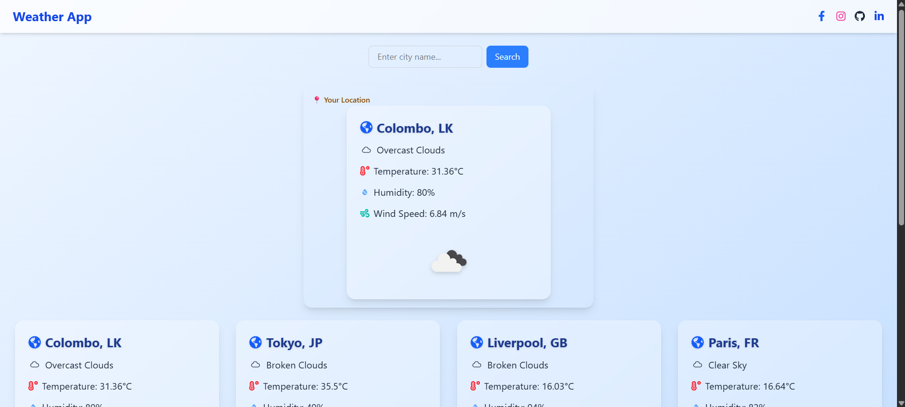
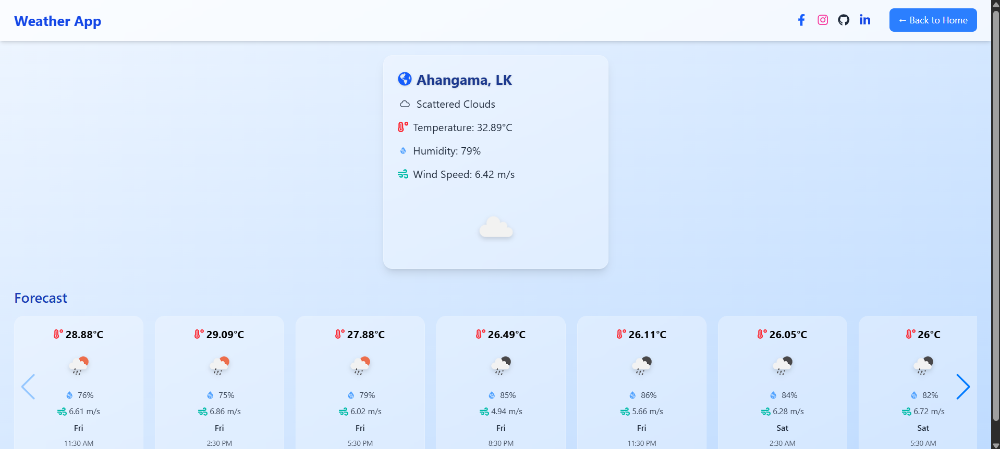
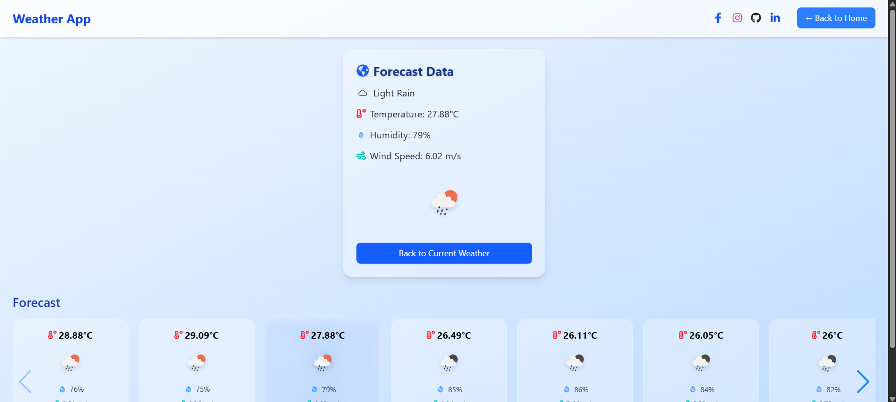

# Weather App 🌦️

A modern, responsive weather application built with **React**, **Tailwind CSS**, and the **OpenWeatherMap API**. This app allows users to check real-time weather conditions and 5-day forecasts for cities worldwide, including their current location. It features a sleek, interactive UI with smooth navigation and enhanced user experience.

## Features ✨

- 🌍 **Current Weather**: View real-time weather data (temperature, humidity, wind speed, and conditions) for any city or your current location.
- 📅 **5-Day Forecast**: Explore a detailed 5-day forecast with temperature, humidity, wind speed, and weather conditions in an interactive carousel.
- 🔍 **City Search**: Search for weather conditions by city name with instant results.
- 📍 **Geolocation**: Automatically detect and display weather for the user's current location.
- 🖼️ **Interactive UI**: Features a responsive design with Swiper.js for forecast carousels, hover effects, and Tailwind CSS for modern styling.
- 🚀 **Smooth Navigation**: Built with React Router for seamless page transitions and a dynamic header with a "Back to Home" button.
- 📱 **Mobile-Friendly**: Fully responsive design optimized for all screen sizes.
- 🔄 **Loading States**: Displays a custom spinner during data fetching for a polished user experience.
- 🖌️ **Enhanced Visuals**: Includes weather icons, hover animations, and a glassmorphism-inspired UI with backdrop blur effects.

## Live Demo 🌐

Check out the live version of the Weather App here: [Weather App](https://weather-app-thilina.netlify.app/)

## Tech Stack 🛠️

- **React**: Frontend library for building dynamic user interfaces.
- **Tailwind CSS**: Utility-first CSS framework for responsive and modern styling.
- **Swiper.js**: Powers the interactive 5-day forecast carousel with navigation and pagination.
- **React Router**: Enables client-side routing for smooth page transitions.
- **OpenWeatherMap API**: Provides real-time weather and forecast data for cities and coordinates.
- **React Icons**: Includes weather-related icons for temperature, humidity, wind, and more.
- **Vite**: Fast build tool for development and production builds.

## Installation ⚙️

Follow these steps to set up the project locally:

1. **Clone the Repository**:
   ```bash
   git clone https://github.com/IT22003850/weather-app---react.git
   cd weather-app
   ```

2. **Install Dependencies**:
   ```bash
   npm install
   ```

3. **Set Up Environment Variables**:
   Create a `.env` file in the root directory and add your OpenWeatherMap API key:
   ```env
   VITE_WEATHER_API_KEY=your-api-key-here
   ```
   Get your API key from [OpenWeatherMap](https://openweathermap.org/api).

4. **Run the Development Server**:
   ```bash
   npm run dev
   ```
   The app will be available at `http://localhost:5173`.

5. **Build for Production**:
   ```bash
   npm run build
   ```

## Usage 📖

- **Home Page**:Search for a city or view weather for your current location and default cities (e.g., Tokyo, London, Paris). Click a city card to see detailed weather data.
- **City Page**: Displays detailed weather information for a selected city and a 5-day forecast in an interactive Swiper carousel. Click a forecast card to view its details, with a "Back to Current Weather" button for navigation.
- **Navigation**: Use the header's "Back to Home" button or social media links for quick navigation.
- **Error Handling**: Displays user-friendly error messages for invalid city names or API failures.
- **Interactive Forecast**: Forecast cards highlight on selection with a glowing ring and shadow effect for better user engagement.


## Screenshots 📸

Below are screenshots of the Weather App showcasing the **Home page** and **City page**:

### Home Page

*Displays the search bar, user location weather, and default city cards.*

### Home Page(search)

*Displays the search bar, user location weather, and default city cards.*

### City Page

*Shows detailed weather information for a selected city and the 5-day forecast carousel.*

### City Page(forecast)

*Shows detailed weather information for a selected city and the 5-day forecast carousel.*

## Folder Structure 📁

```
weather-app---react/
├── public/
│   ├── _redirects
├── src/
│   ├── components/
│   │   ├── CityCard.jsx
│   │   ├── Layout.jsx
│   │   └── Spinner.jsx
│   ├── pages/
│   │   ├── City.jsx
│   │   ├── Home.jsx
│   │   └── NotFound.jsx
│   ├── App.jsx
│   ├── App.css
│   └── main.jsx
├── .env
├── index.html
├── package.json
├── vite.config.js
└── README.md
```


## Contact 📬

For questions or feedback, reach out via:

- **Email**: thilinat.dev@gmail.com

Enjoy exploring the weather! ☀️🌧️❄️